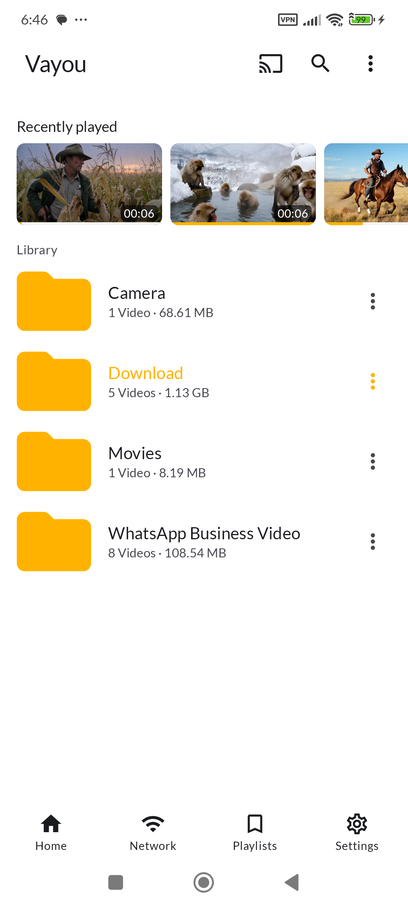
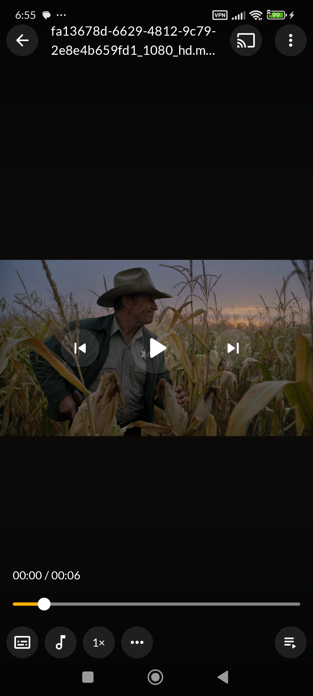
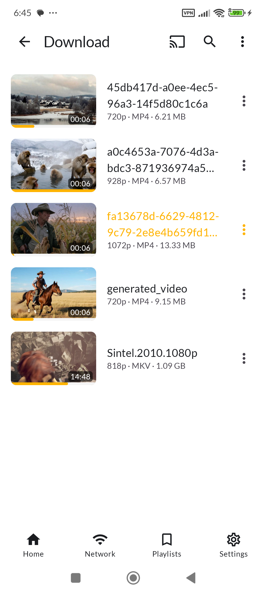
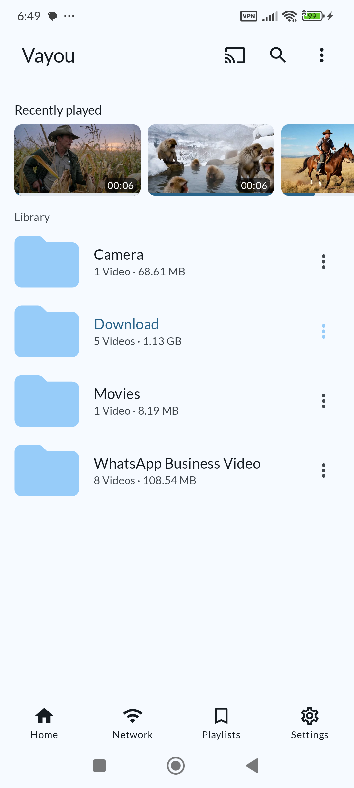
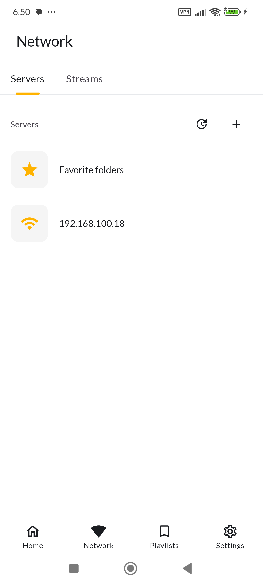
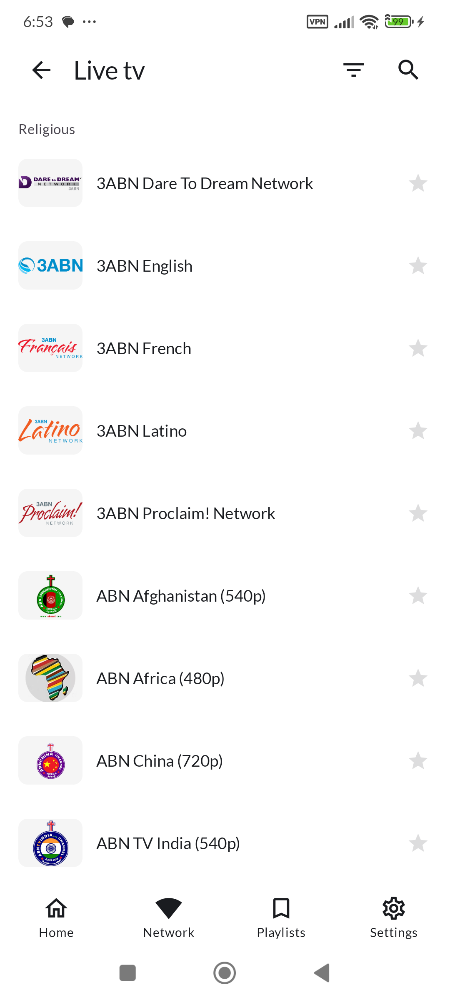
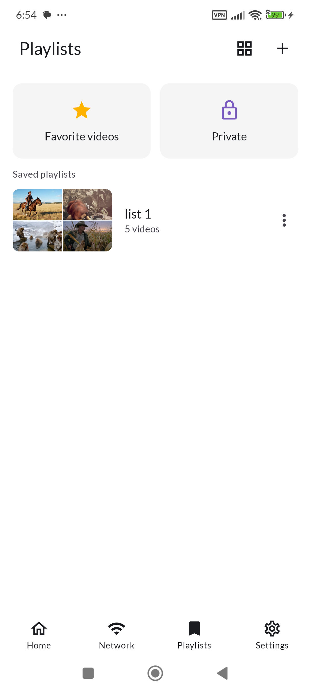
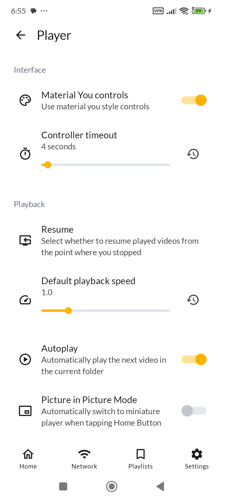

# Vayou

Vayou is a native Android video player written in Kotlin and Jetpack Compose. It provides a simple, modern interface for playing videos on phones, tablets and Android TV.

**This project is under active development. Expect rough edges.**

## Screenshots

| Home | Player | Library | Material You |
|:---:|:---:|:---:|:---:|
|  |  |  |  |

| Network | Live TV | Playlists | Settings |
|:---:|:---:|:---:|:---:|
|  |  |  |  |

## Supported formats

- **Video**: H.263, H.264 AVC (Baseline Profile; Main Profile on Android 6+), H.265 HEVC, MPEG-4 SP, VP8, VP9, AV1
  - Support depends on the Android device
- **Audio**: Vorbis, Opus, FLAC, ALAC, PCM/WAVE (μ-law, A-law), MP1, MP2, MP3, AMR (NB, WB), AAC (LC, ELD, HE; xHE on Android 9+), AC-3, E-AC-3, DTS, DTS-HD, TrueHD
  - Support provided by the ExoPlayer FFmpeg extension
- **Subtitles**: SRT, SSA, ASS, TTML, VTT, DVB
  - SSA/ASS has limited styling support

## Features

- Native Android app with a simple, easy-to-use interface
- Free and open source, no ads, no excessive permissions
- Software decoders for H.264 and HEVC
- Audio/subtitle track selection
- Vertical swipe to change brightness (left) / volume (right)
- Horizontal swipe to seek
- Material 3 (You) support with dynamic color
- Media picker with tree, folder and file views
- Playback from URL
- Playback via Storage Access Framework
- Playback speed control
- External subtitle support
- Zoom gesture
- Picture-in-picture mode

## Planned features

- External audio support
- Background playback
- Android TV app
- Search

## License

Vayou is licensed under the GNU General Public License v3.0. See the [LICENSE](LICENSE) file for details.
