# Vayou for Android

Two media players from one codebase: a **phone and tablet** app, and an **Android TV** app. Built on Media3 / ExoPlayer with a bundled FFmpeg decoder for the formats a device's own hardware refuses, and written entirely in Kotlin and Jetpack Compose.

[](LICENSE)


| Phone | Television |
|---|---|
| 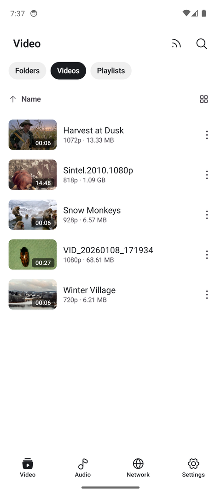 | 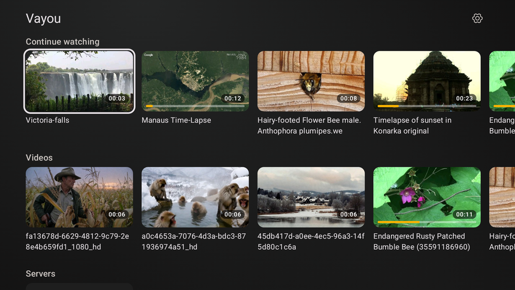 |

---

## Two apps, one codebase

They are separate listings on the store and separate installs — a phone is not a television and the two share no screen — but every layer beneath the interface is the same code.

| | Phone & tablet | Android TV |
|---|---|---|
| Application id | `dev.vayou` | `dev.vayoutv` |
| Module | `:app` | `:app-tv` |
| Interface | Material 3, touch, `androidx.compose.material3` | `androidx.tv.material3`, laid out for a remote at three metres |
| Shared | the player, the library, the database, the network stack, the design tokens | |

---

## Features

### Playback
- Resume where a film was left, or always from the start — your choice, per install
- Play the next video in the folder automatically
- A–B repeat, with the two points set from the player
- Speed from a quick picker, remembered between films
- Sleep timer, including *when this one ends*
- Picture in picture: the film shrinks into a corner when you leave
- Keep the sound going once the player is closed
- Skip silence
- Zoom modes: best fit, stretch, crop, 100%
- Screen orientation: follow the phone, either landscape, portrait, or match the film's own shape
- Lock the controls, so a palm on the screen does nothing

### Video
- Hardware decoding first, falling back to the bundled FFmpeg decoder when a file will not open — or forced either way, for finding out which of the two is at fault
- Brightness remembered between films
- Ambient glow: the bars either side of a film take its own colour
- Thumbnails generated from a frame you choose — the first, one further in past the titles, or further in with a fallback when that frame is a flat colour

### Audio & music
- A music library of its own: songs, playlists, folders, albums, artists
- Five-band equalizer at 60, 230, 910, 3600 and 14000 Hz — Android's own effect, so it applies to
  whatever is playing — with presets for flat, voice, classical, dance, folk, heavy metal, hip hop,
  jazz, pop and rock, and a curve of your own. The voice preset exists because no genre curve serves
  speech: it cuts the rumble under 300 Hz and lifts the consonants around 3.6 kHz, which is what
  "I can't make out the words" usually means
- Queue you can reorder by holding a row
- Shuffle and repeat
- Edit tags and change a cover from inside the app
- Volume boost to twice what the phone gives
- Give way to other apps: pause for a call, quieten for a notification
- Pause when the headphones come out

### Subtitles
- Embedded and external tracks, opened from the file or picked from storage
- **OpenSubtitles** search, by file or by name
- **Live translation** of the running subtitle
- Delay adjustment, forward and back
- Style: font, size, vertical position, colour, outline, shadow, background plate, bold
- Honour the styling a subtitle was written with, or override it
- Or hand the whole question to Android's own caption settings

### Library
- Folders, a flat list of everything, and playlists — each with its own scroll
- Grid or list, per taste
- Sort by name, date added, length, size or location
- Favourites, and a **Private** shelf for what should not appear in the library
- Recently played, above everything
- A bar under each thumbnail showing how far in you got
- Search across videos and folders, with recent searches remembered
- Leave folders out of the library entirely

### Network
- **SMB shares**: discovered on the network or added by address, browsed and played without downloading
- Pin the folders you open often
- **Channel lists** (M3U): add by address, browse by country or group, keep favourites

### Casting
- Google Cast, with the file on your phone served to the receiver over the local network — a Chromecast fetches from the phone rather than being sent a copy
- Subtitles travel with it
- Android's own output switcher, from the volume keys, reaches the same receivers

### Appearance & language
- Follow the system, light, dark, or black
- Accent colour taken from the wallpaper, where Android offers it
- **Eleven languages**: English, Português (Brasil), Español, Français, Deutsch, Русский, العربية, हिन्दी, Türkçe, Tiếng Việt, Bahasa Indonesia — with right-to-left laid out properly, not mirrored by accident

---

## Screenshots

### Phone

| Library | Player | Music |
|---|---|---|
|  | 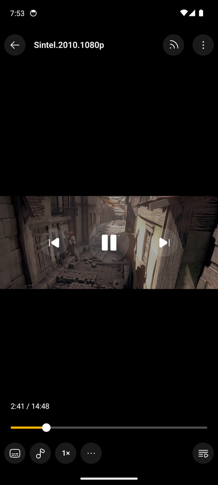 | 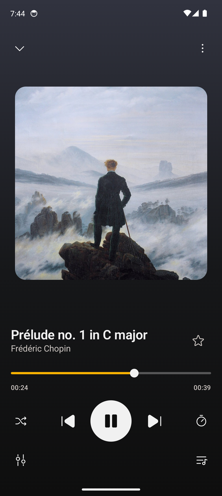 |
| Folders, sizes and how far in you got | Controls that hide themselves, gestures on the picture | The cover tints the screen it sits on |

| Songs | Mini player | Network |
|---|---|---|
| 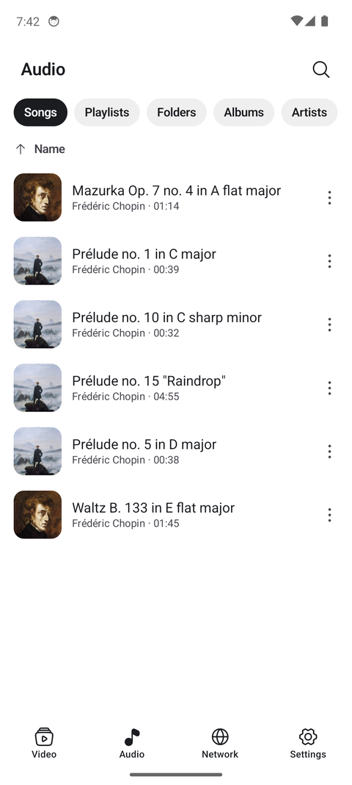 | 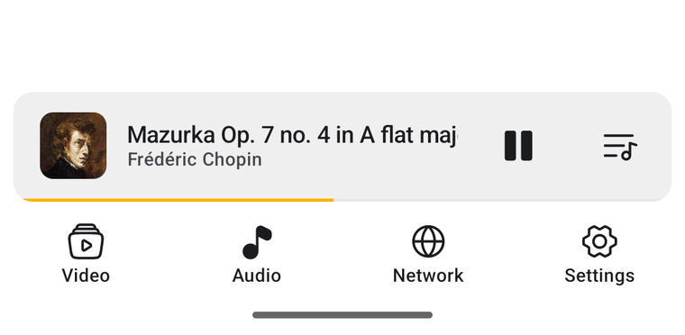 | 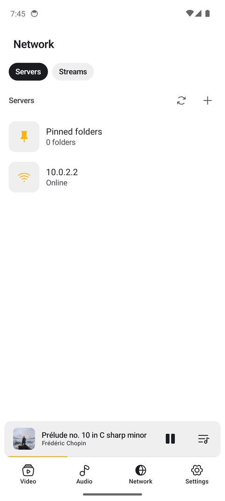 |
| A music library of its own | What is playing, above the library | Shares and channel lists |

| Channels | Settings | Appearance |
|---|---|---|
| 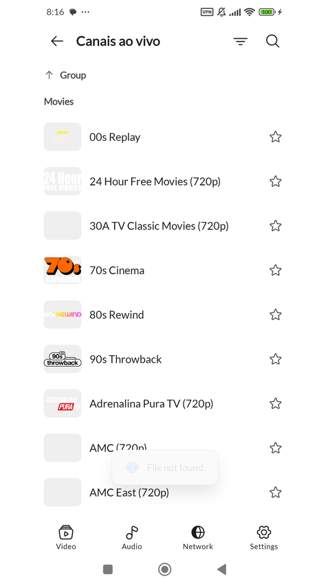 | 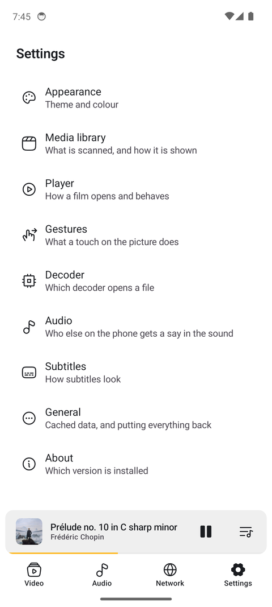 | 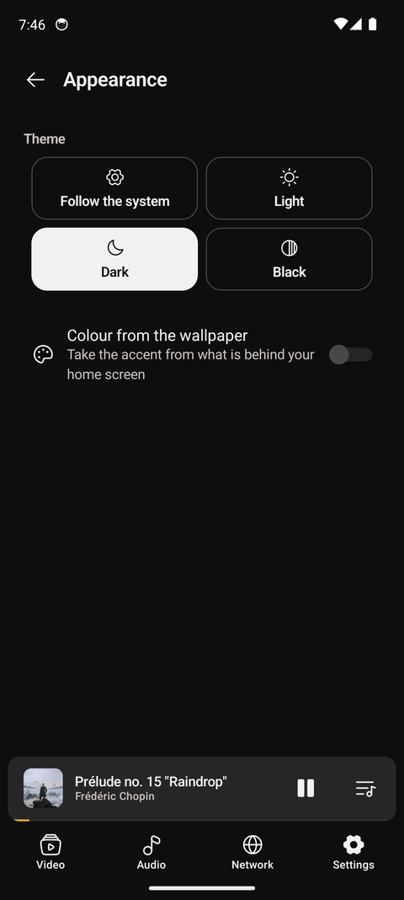 |
| Channel lists by country and group | Nine sections, each explained in a sentence | Theme, and the accent from your wallpaper |

| Subtitles, in landscape |
|---|
| 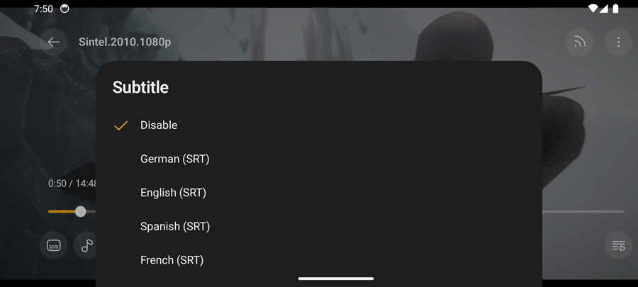 |
| Size, position, colour, outline, background — over the film, changed while it plays |

| Dark | Tablet |
|---|---|
| 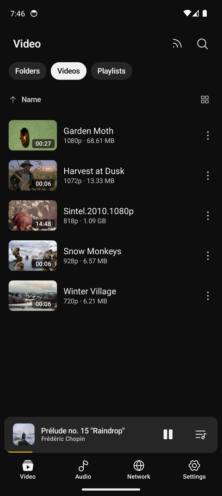 | 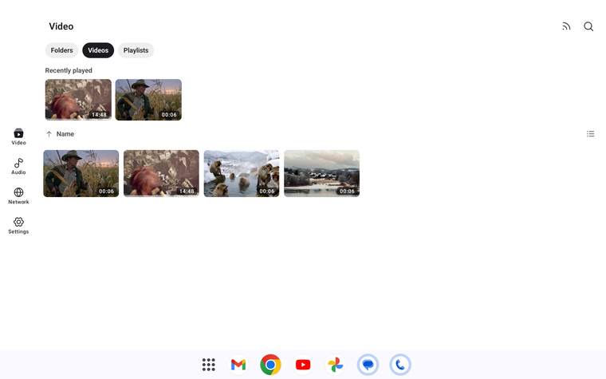 |

### Android TV

| Home | Videos |
|---|---|
|  | 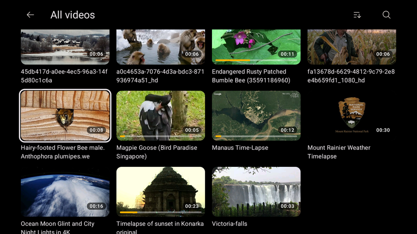 |
| Continue watching, then the library, then the shares | A grid a remote can cross in a few presses |

| Player | Options |
|---|---|
| 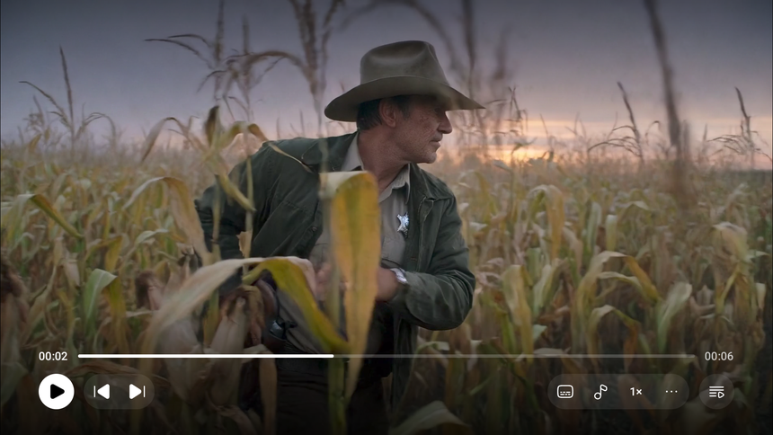 | 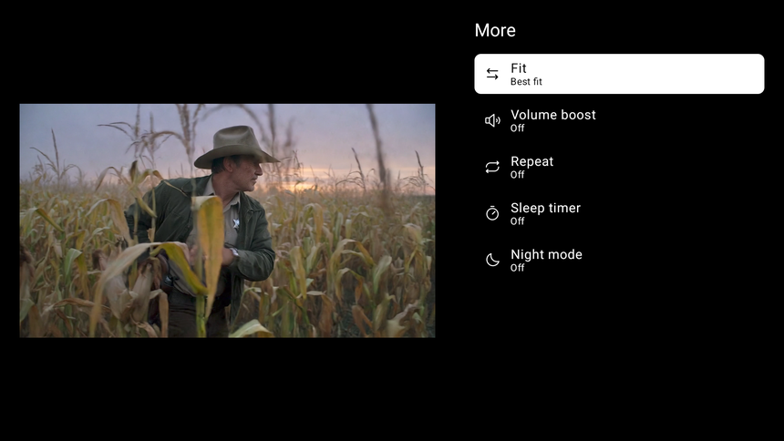 |
| | Audio, subtitles, speed, fit, repeat, sleep timer, night mode |

| Music | Channels |
|---|---|
| 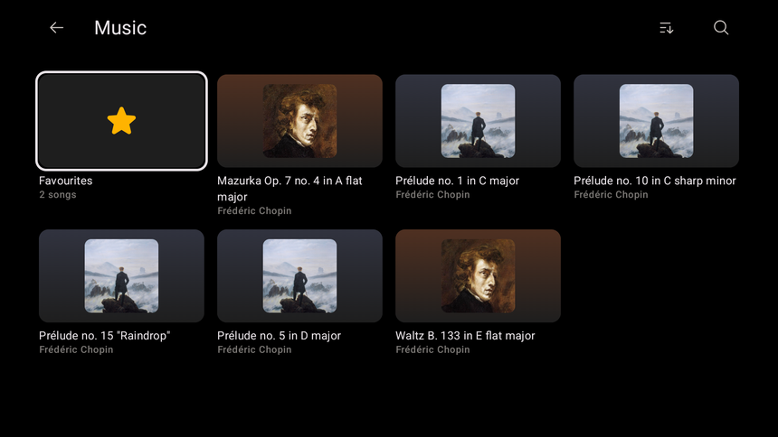 | 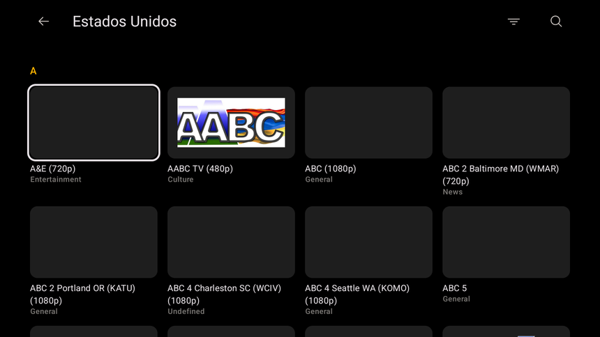 |

---

## Building from source

### Prerequisites

- **JDK 17** — the toolchain the build asks for
- **Android SDK** with platform 37 and build-tools 37
- No NDK: the FFmpeg decoder arrives as a prebuilt dependency

### Build

```bash
./gradlew :app:assembleDebug        # phone and tablet
./gradlew :app-tv:assembleDebug     # android tv
```

Both install side by side — they carry different application ids, and the debug builds add a `.debug` suffix on top of that, so a debug build never displaces one installed from the store.

### Release

Signing is read from `keystore.properties` at the project root, which is not committed:

```properties
RELEASE_STORE_FILE=/path/to/upload.jks
RELEASE_STORE_PASSWORD=…
RELEASE_KEY_ALIAS=upload
RELEASE_KEY_PASSWORD=…
```

Without that file the release build still runs and produces an unsigned artefact.

```bash
./gradlew :app:bundleRelease        # .aab for the store
./gradlew :app:assembleComparable   # release code, debug key, installable
```

`comparable` exists to be measured against: a debug build has no R8 and is `debuggable`, which in Compose is several times slower to open a sheet, so timing a debug build against a release one measures the two build types rather than the two versions.

### Checks

```bash
./gradlew ktlintCheck               # formatting and unused imports
./gradlew ktlintFormat              # fix what can be fixed
```

---

## Architecture

```
app/                    # phone and tablet shell — one activity, the nav bar, the permission
app-tv/                 # android tv shell — its own screens, built on androidx.tv.material3

core/
├── common/             # dispatchers, scopes, context extensions
├── model/              # the domain types, with no android in them
├── database/           # room: media, directories, playback state
├── datastore/          # preferences
├── data/               # repositories and the mappers into the domain types
├── domain/             # use cases — the library as one sorted thing
├── media/              # the device's own media store, and the scan that follows it
├── imageloader/        # coil: video thumbnails, audio artwork
├── player/             # the player, the session, the notification, cast
├── smb/                # shares and channel lists
└── ui/                 # the design system: tokens, components, theme

feature/
├── library/            # the video library
├── music/              # the music library and its player
├── network/            # shares, streams, channels
├── player/             # the video player
└── settings/           # nine sections

build-logic/            # convention plugins — one place that knows what an android module is
```

**State flows down, events flow up.** A screen is handed what it draws and hands back what was pressed; nothing above the data layer knows where a file came from, and nothing below it knows what a screen looks like.

**One player, whatever is playing it.** The session is handed a `CastPlayer` wrapping the local one: it forwards to ExoPlayer while nothing is connected, and moves the queue and the position across when a television is picked. The screens, the notification and the lock screen talk to one `Player` and never learn which.

**Casting a local file** needs something no SDK provides: a receiver is another machine, and `content://media/external/…` means nothing outside this process. So a small web server runs on the phone for as long as a session lasts, publishing each address as an `http://` one, answering byte ranges so that scrubbing works.

**Convention plugins, not copied blocks.** Every module's Android configuration comes from `build-logic`, so there is one answer to what compile SDK, what Java version, what Compose settings — rather than nineteen answers that drift.

---

## Gestures and the remote

### On the picture

| Gesture | Does |
|---|---|
| Swipe sideways | Move through the film |
| Swipe up / down, left half | Brightness |
| Swipe up / down, right half | Volume — optionally to twice what the phone gives |
| Pinch | Fill the screen with the picture |
| Double tap | Skip back and forward, or play/pause, or skip at the edges and play in the middle — your choice |
| Single tap | Show the controls, which hide themselves again after a while you set |

Every one of them can be turned off.

### On the remote

Directional pad to move, centre to open, back to leave. Play/pause, previous and next are taken from the remote's own media keys where it has them. Holding a key repeats; the first press of a held key is the only one that counts as a press.

---

## Where things are kept

Everything lives in the app's own storage, which no other app can read and which uninstalling removes:

| | |
|---|---|
| Library, playback positions, playlists | Room database |
| Settings | DataStore |
| Thumbnails and covers | Coil's disk cache — clearable from **Settings → General** |
| Server addresses, channel lists, favourites | JSON in the app's files directory |

Nothing is sent anywhere except when you ask for it: an online subtitle search, a subtitle translation, or a channel list you added.

### Permissions

| Permission | For |
|---|---|
| `READ_MEDIA_VIDEO`, `READ_MEDIA_AUDIO` | Listing what is on the device. Asked for on arrival; refused, the library says so and offers the way to the system's own page |
| `INTERNET` | Online subtitles, subtitle translation, channel lists, shares |
| `ACCESS_WIFI_STATE` | Finding shares on the local network |
| `FOREGROUND_SERVICE`, `FOREGROUND_SERVICE_MEDIA_PLAYBACK` | Keeping the sound going with the screen off |

---

## Third-party components

| Component | Licence |
|---|---|
| **AndroidX Media3 / ExoPlayer** | Apache-2.0 |
| **media3-ffmpeg-decoder** ([anilbeesetti/nextlib](https://github.com/anilbeesetti/nextlib)) | The FFmpeg build it wraps is LGPL-2.1-or-later |
| **SMBJ** | Apache-2.0 |
| **Coil 3** | Apache-2.0 |
| **NanoHTTPD** | BSD-3-Clause |
| **Google Cast SDK** | Subject to the [Google APIs terms](https://developers.google.com/terms) |
| **OpenSubtitles** | Subject to the [OpenSubtitles terms of service](https://www.opensubtitles.org/en/terms) |

---

## Related

- **[vayou-desktop](https://github.com/0hgawa/vayou-desktop)** — the same idea on Windows, built on libmpv with a Svelte and Tauri front end

---

## License

[GPL-3.0](LICENSE) — see the LICENSE file for the full text.
